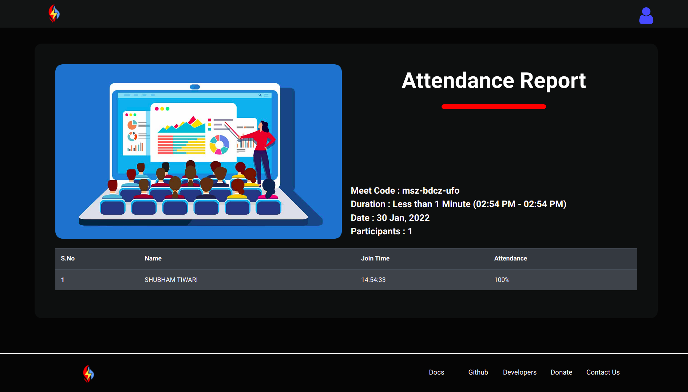
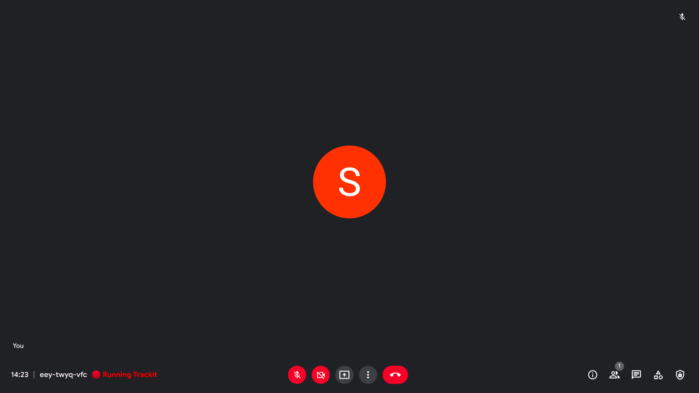

# Trackit Web✨

###### Firefox Extension

Automatically save attendance during google meet video calls.

The extension records attendance automatically when you are in a meet and saves it. Once the meet is over it will open the attendance report in a new tab. You can access your saved attendance data anytime on our website [https://trackitnow.pythonanywhere.com](https://trackitnow.pythonanywhere.com).

Get the extension on [https://addons.mozilla.org/en-US/firefox/addon/trackit](https://addons.mozilla.org/en-US/firefox/addon/trackit)

## Donate

[https://www.buymeacoffee.com/blaze2004]()

### Images 🚀

---

1). The extension starts automatically when you enter in a meet.

2). Once, the meet is  over your attendance report is displayed in a new tab.

no manual work required ! it's fully automatic.

